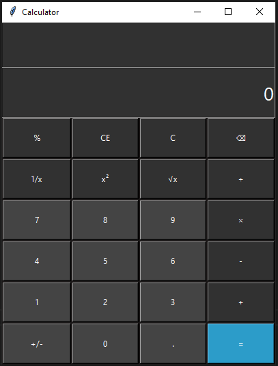

# 🧮 Python Tkinter Calculator

A simple yet powerful **desktop calculator** built using **Python** and **Tkinter**.  
This project demonstrates GUI development in Python and provides basic arithmetic operations in a clean, user-friendly interface.

---

## 🚀 Features

- 🧩 Basic arithmetic operations: addition, subtraction, multiplication, and division  
- 🪟 Intuitive and responsive Tkinter interface  
- ⌨️ Keyboard input support  
- 💡 Clear and Delete functions  
- 🎨 Easy-to-read layout and dynamic display  

---

## 🖥️ Screenshot

> *(Optional — add a screenshot of your calculator here)*  
> Example:  
> 

---

## ⚙️ Installation

Clone the repository and run the calculator locally.

```bash
# Clone this repository
git clone https://github.com/HosseinSedghian/Calculator.git

# Navigate to the project folder
cd Calculator

# Run the calculator
python calculator.py
